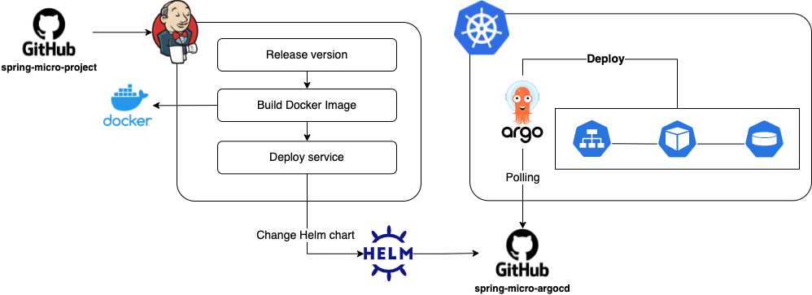

# spring-micro-session
In this project, I will create a simple Session service which can store cache data.
This is the project to make a microservice architecture using Spring boot framework.
This project is getting evolved as times go on.

## Microservice Architecture

## Deployment
This project is deployed by Jenkins and ArgoCD.

## Authors
Allen Kim - Initial work - [coolexplorer](https://github.com/coolexplorer)

## License
This project is licensed under the MIT License - see the LICENSE.md file for details
